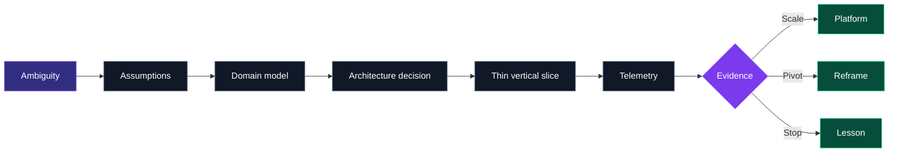

<picture>
  <source media="(prefers-color-scheme: dark)" srcset="./assets/hero-dark.svg">
  <source media="(prefers-color-scheme: light)" srcset="./assets/hero-light.svg">
  
</picture>

<p align="center">
  <a href="https://www.joefathi.com"></a>
  <a href="https://www.solyte.life"></a>
  <a href="https://github.com/prvn-raj/product-lab"></a>
</p>

<p align="center">
  
  
  
  
  
</p>

<div align="center">

<a href="https://git.io/typing-svg">
  
</a>

</div>

---

## `praveen@github:~$ ./whoami --verbose`

```yaml
identity:       Praveen Raj
location:       Bengaluru, India
uptime:         20+ years in technology
production_env: fintech
operating_mode:
                - architect
                - builder
                - fixer
current_branch: corporate-banking-platforms
side_hustle:
                - Solyte
                - Solflow
                - Turning Point
                - Claque
private_repos:  28+
debug_mode:     permanently_enabled
last_incident:  classified
status:         shipping
```

I work at the intersection of **technology, product, business and human behaviour** the place where ambitious ideas usually become complicated systems.

Two decades in FinTech taught me how systems really work. Not only the ones in code the ones in meeting rooms, operating models, customer journeys, budgets, incentives and production incidents at 2 a.m.

> **Senior engineer by origin. Technology executive by accumulated side effects.**

---

## Core runtime capabilities

<table>
<tr>
<td width="50%" valign="top">

### 🧩 Cross-domain systems thinking

I see how product, money, people and technology connect and where the system will break before the diagram admits it.

</td>
<td width="50%" valign="top">

### 🗣 Strategic translation

I turn fuzzy ambition into clear action. Founders get a product path. Executives get past the buzzwords. Engineers get decisions they can build against.

</td>
</tr>
<tr>
<td width="50%" valign="top">

### 🏗 Execution architecture

I do not stop at strategy. I build frameworks that ship: products, platforms, automation, operating models and technical foundations.

</td>
<td width="50%" valign="top">

### 🔐 Trust under complexity

Confidential builds. Enterprise politics. Founder conviction. High-stakes decisions need judgment—and knowing what should remain unsaid.

</td>
</tr>
</table>

---

## `praveen.build(idea)`



```text
INPUT      Business intent, user friction, technical constraints
COMPILE    Assumptions → domain model → architecture decision
EXECUTE    Smallest meaningful vertical slice
OBSERVE    Telemetry, behaviour, defects, operational load
RETURN     Scale | pivot | stop
```

---

## Choose your operating context

<table>
<tr>
<td width="33%" valign="top">

### `01/startups`

**You have chaos.  
I have frameworks.**

Product technology and architecture  
Market proofing  
Capital discipline  
From “cool idea” to something customers use

</td>
<td width="33%" valign="top">

### `02/enterprises`

**You have growth.  
I have gravity.**

AI and automation strategy  
Digital operating models  
Architecture and engineering standards  
Making scale repeatable

</td>
<td width="33%" valign="top">

### `03/visionaries`

**You have ideas.  
I have ignition.**

Concept to creation  
Strategic orchestration  
Private product lab  
Private. Precise. No agency theatre.

</td>
</tr>
</table>

---

## `/opt/praveen/private-product-lab`

> **28+ private repositories. The code stays closed. The curiosity does not.**

The lab is where I test products before they become presentations, companies or cautionary tales.

<table>
<tr>
<td width="50%" valign="top">

### 🧠 Solyte · PsyTech

An evolving human-intelligence platform built around cognitive, emotional, stress, personality and behavioural signals.

`Assessment systems` `Neural identity` `AI interpretation`

</td>
<td width="50%" valign="top">

### 🌊 Solflow · Personal Analytics

A calm, typography-first momentum system connecting hydration, calories, workouts and expenses.

`Flutter` `Behaviour design` `Personal data`

</td>
</tr>
<tr>
<td width="50%" valign="top">

### 🧭 Turning Point · EdTech

Decision intelligence for students and institutions—beyond static aptitude reports.

`Assessment engine` `Guidance` `Institutions`

</td>
<td width="50%" valign="top">

### 👏 Claque · Simulated Audience

A simulated live audience with configurable viewers, comments, reactions and believable pacing.

`Flutter` `Supabase` `Interaction experiment`

</td>
</tr>
<tr>
<td width="50%" valign="top">

### 📦 Karma Box · Behavioural Product

A compact experiment around reflection, intent, action and personal accountability.

`Mobile` `Reflection` `Behaviour loop`

</td>
<td width="50%" valign="top">

### 🔦 Classified · Unnecessary Innovation

Luxury flashlights, premium photons, fake scientific controls and other products nobody requested.

`Satire` `Consumer apps` `Questionable necessity`

</td>
</tr>
</table>

<p align="center">
  <a href="https://github.com/prvn-raj/product-lab"></a>
</p>

---

## Protocol stack

```text
┌──────────────────────────────────────────────────────────────────────┐
│ DOMAIN       Corporate Banking · FinTech · PsyTech · EdTech         │
├──────────────────────────────────────────────────────────────────────┤
│ EXPERIENCE   Product Strategy · Delivery · Architecture · Platforms │
├──────────────────────────────────────────────────────────────────────┤
│ CHANNELS     Flutter · Dart · React · JavaScript · Mobile · Web     │
├──────────────────────────────────────────────────────────────────────┤
│ SERVICES     Java · Spring · Node.js · REST APIs · Microservices    │
├──────────────────────────────────────────────────────────────────────┤
│ EVENTS       Kafka · IBM MQ · Event-Driven Architecture             │
├──────────────────────────────────────────────────────────────────────┤
│ CLOUD        AWS · Docker · Kubernetes · Helm · Terraform           │
├──────────────────────────────────────────────────────────────────────┤
│ DATA         PostgreSQL · Supabase · Analytics · Signal Models      │
├──────────────────────────────────────────────────────────────────────┤
│ DELIVERY     GitHub · Jenkins · CI/CD · JIRA · Confluence           │
├──────────────────────────────────────────────────────────────────────┤
│ AUGMENTATION AI-Assisted Engineering · Claude Code · Codex          │
└──────────────────────────────────────────────────────────────────────┘
```

<p>
  
  
  
  
  
  
  
  
  
  
  
  
  
  
  
</p>

---

## Architecture decision records

| ADR | Decision | Status |
|---|---|---|
| `ADR-001` | Architecture should reduce uncertainty |  |
| `ADR-007` | Build the smallest meaningful vertical slice first |  |
| `ADR-013` | Complexity is not sophistication |  |
| `ADR-021` | Add microservices because everyone else did |  |
| `ADR-034` | Automate before understanding the process |  |
| `ADR-042` | Stop when evidence says stop |  |
| `ADR-404` | Documentation will write itself |  |

---

## Production scar tissue

<details>
<summary><b>Open the incident archive</b></summary>
<br>

```text
[✓] Debugged the problem nobody could reproduce
[✓] Migrated XML that had no surviving documentation
[✓] Explained eventual consistency to a steering committee
[✓] Watched “a small frontend change” cross five systems
[✓] Found the root cause outside the system being investigated
[✓] Seen UAT success become production archaeology
[✓] Learned that ownership is an architectural dependency
[✓] Replaced elegant designs with operable ones
[✓] Survived environment parity discussions
[✓] Asked “what changed?” before asking “who changed it?”
```

```yaml
known_failure_modes:
  - schema_drift
  - retry_storms
  - stale_reference_data
  - distributed_ownership
  - undocumented_filters
  - environment_parity
  - late_business_requirements
  - silent_fallbacks
  - "works_in_uat"
```

</details>

---

## Technology archaeology

```text
2004 ── Enterprise Java, XML, monoliths and deployment rituals
2009 ── Service integration, middleware and message queues
2014 ── APIs, platforms, automation and DevOps
2019 ── Cloud-native delivery and event-driven systems
2024 ── Product architecture and AI-assisted engineering
2026 ── Human intelligence, behavioural products and private labs

STATUS: legacy does not mean irrelevant
LESSON: every “temporary” integration eventually requests production support
```

---

## Engineering telemetry

<picture>
  <source media="(prefers-color-scheme: dark)" srcset="https://github-profile-summary-cards.vercel.app/api/cards/profile-details?username=prvn-raj&theme=github_dark">
  <source media="(prefers-color-scheme: light)" srcset="https://github-profile-summary-cards.vercel.app/api/cards/profile-details?username=prvn-raj&theme=github">
  
</picture>

<picture>
  <source media="(prefers-color-scheme: dark)" srcset="https://github-readme-activity-graph.vercel.app/graph?username=prvn-raj&theme=github-compact&hide_border=true&area=true">
  <source media="(prefers-color-scheme: light)" srcset="https://github-readme-activity-graph.vercel.app/graph?username=prvn-raj&theme=minimal&hide_border=true&area=true">
  
</picture>

```text
YEARS_IN_TECHNOLOGY       20+
PRIVATE_BUILDS            28+
PRIMARY_DOMAINS           FINTECH · PSYTECH · EDTECH
CURRENT_MODE              ARCHITECT / BUILDER / FIXER
PRODUCTION_SCARS          REDACTED
TECH_DEBT                 OBSERVED
MEETINGS                  RATE_LIMITED
```

---

## `/var/log/praveen/current.log`

```log
INFO  building     modern corporate-banking platforms
INFO  exploring    AI for product, architecture and engineering
INFO  designing    human-intelligence and assessment systems
INFO  prototyping  mobile products before they become sensible
INFO  creating     ambient sound worlds that do not exist
INFO  practising   salsa, systems thinking and selective impatience
WARN  curiosity    exceeds available weekend capacity
```

---

## My journey, without the corporate voice

```text
1996 → PRESENT   THE EDUCATION PHASE
                 Mathematics. Computer science. Digital transformation.
                 Graduated thinking I had figured it out. Still patching.

2004 → PRESENT   THE CORPORATE CONDITIONING PHASE
                 Process. Platforms. Promotions. Politics. Patience.
                 Learned that the hardest systems are made of people.

2009 → PRESENT   THE EXPERIMENTER PHASE
                 Ideas are cheap. Execution is expensive.
                 Best practices are suggestions. Build it and observe.

2020 → PRESENT   THE FIXER PHASE
                 Growth hides problems. Bureaucracy kills speed.
                 Sometimes the most valuable technical decision is “stop”.
```

---

## Contributions, consumed as technical debt

<picture>
  <source media="(prefers-color-scheme: dark)" srcset="https://raw.githubusercontent.com/prvn-raj/prvn-raj/output/github-contribution-grid-snake-dark.svg">
  <source media="(prefers-color-scheme: light)" srcset="https://raw.githubusercontent.com/prvn-raj/prvn-raj/output/github-contribution-grid-snake.svg">
  
</picture>

---

## `connect --human`

For the longer version—the work, journey and philosophy:

<p>
  <a href="https://www.joefathi.com"></a>
  <a href="https://www.solyte.life"></a>
  <a href="https://github.com/prvn-raj"></a>
</p>

> **If it is a five-minute answer, I will share it immediately. If it needs more time, I will tell you that too.**

<p align="center">
  <b>No bots. No assistants. No sales scripts.</b><br>
  <code>exit 0</code>
</p>
