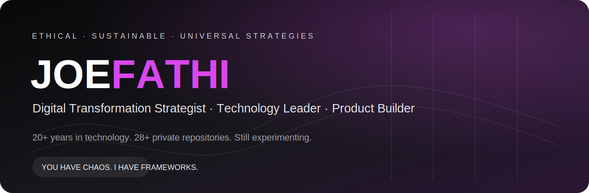

<picture>
  <source media="(prefers-color-scheme: dark)" srcset="./assets/hero-dark.svg">
  <source media="(prefers-color-scheme: light)" srcset="./assets/hero-light.svg">
  
</picture>

<p align="center">
  <a href="https://www.joefathi.com"></a>
  <a href="https://www.solyte.life"></a>
  <a href="https://github.com/prvn-raj/product-lab"></a>
</p>

## Nice to meet you. I’m Raj.

**Digital Transformation Strategist based in Bengaluru, India.**

I work at the intersection of **technology, product, business and human behaviour**—the place where ambitious ideas usually become complicated systems.

Two decades in FinTech taught me how systems really work. Not only the ones in code—the ones in meeting rooms, operating models, customer journeys, budgets, incentives and production incidents at 2 a.m.

These days, I do four things particularly well:

<table>
<tr>
<td width="50%" valign="top">

### 🧩 Cross-domain systems thinking

I see how product, money, people and technology connect—and where the system will break before the diagram admits it.

</td>
<td width="50%" valign="top">

### 🗣 Strategic translation

I turn fuzzy ambition into clear action. Founders get a product path. Executives get past the buzzwords. Engineers get decisions they can build against.

</td>
</tr>
<tr>
<td width="50%" valign="top">

### 🏗 Execution architecture

I do not stop at strategy. I build frameworks that ship: products, platforms, automation, operating models and technical foundations.

</td>
<td width="50%" valign="top">

### 🔐 Trust under complexity

Confidential builds. Enterprise politics. Founder conviction. High-stakes decisions need judgment—and knowing what should remain unsaid.

</td>
</tr>
</table>

---

## Choose your situation

<table>
<tr>
<td width="33%" valign="top">

### 01 · Startups

**You have chaos.  
I have frameworks.**

Product technology and architecture  
Market proofing  
Capital discipline  
From “cool idea” to something customers use

</td>
<td width="33%" valign="top">

### 02 · Emerging enterprises

**You have growth.  
I have gravity.**

AI and automation strategy  
Digital operating models  
Architecture and engineering standards  
Making scale repeatable

</td>
<td width="33%" valign="top">

### 03 · Visionaries

**You have ideas.  
I have ignition.**

Concept to creation  
Strategic orchestration  
Confidential build lab  
Private. Precise. No agency theatre.

</td>
</tr>
</table>

---

## The Confidential Build Lab

> **28+ private repositories. The code stays closed. The curiosity does not.**

The lab is where I test products before they become presentations, companies or cautionary tales.

<table>
<tr>
<td width="50%" valign="top">

### 🧠 Solyte · PsyTech

An evolving human-intelligence platform built around cognitive, emotional, stress, personality and behavioural signals.

`Assessment systems` `Neural identity` `AI interpretation`

</td>
<td width="50%" valign="top">

### 🌊 Solflow · Personal Analytics

A calm, typography-first momentum system connecting hydration, calories, workouts and expenses.

`Flutter` `Behaviour design` `Personal data`

</td>
</tr>
<tr>
<td width="50%" valign="top">

### 🧭 Turning Point · EdTech

Decision intelligence for students and institutions—beyond static aptitude reports.

`Assessment engine` `Guidance` `Institutions`

</td>
<td width="50%" valign="top">

### 📺 Live Studio · Playful Tech

A simulated live audience with configurable viewers, comments, reactions and believable pacing.

`Flutter` `Supabase` `Interface experiment`

</td>
</tr>
<tr>
<td width="50%" valign="top">

### 📦 Karma Box · Behavioural Product

A compact experiment around reflection, intent, action and personal accountability.

`Mobile` `Reflection` `Behaviour loop`

</td>
<td width="50%" valign="top">

### 🔦 Classified · Unnecessary Innovation

Luxury flashlights, premium photons, fake scientific controls and other products nobody requested.

`Satire` `Consumer apps` `Questionable necessity`

</td>
</tr>
</table>

<p align="center">
  <a href="https://github.com/prvn-raj/product-lab"></a>
</p>

---

## My journey, without the corporate voice

```text
1996 → PRESENT   THE EDUCATION PHASE
                 Mathematics. Computer science. Digital transformation.
                 Graduated thinking I had figured it out. Still patching.

2004 → PRESENT   THE CORPORATE CONDITIONING PHASE
                 Process. Platforms. Promotions. Politics. Patience.
                 Learned that the hardest systems are made of people.

2009 → PRESENT   THE EXPERIMENTER PHASE
                 Ideas are cheap. Execution is expensive.
                 Best practices are suggestions. Build it and observe.

2020 → PRESENT   THE FIXER PHASE
                 Growth hides problems. Bureaucracy kills speed.
                 Sometimes the most valuable technical decision is “stop”.
```

---

## Things I build with

<p>
  
  
  
  
  
  
  
  
  
  
</p>

---

## Public signals

| Project | Experiment | Activity |
|---|---|---|
| [**IIMBVoice**](https://github.com/prvn-raj/IIMBVoice) | Voice and radio-style mobile experience |  |
| [**Livestream**](https://github.com/prvn-raj/livestream) | Flutter live-content interface |  |
| [**MoodWeather**](https://github.com/prvn-raj/moodweather7.0_notifications) | Weather, mood and notification interactions |  |
| [**Tamil Radio**](https://github.com/prvn-raj/onlybelievetamilradio3_enhanceUI) | Audio streaming and mobile UI evolution |  |

---

## Currently

```text
Building        modern corporate-banking platforms
Exploring       AI for product, architecture and engineering
Designing       human-intelligence and assessment systems
Prototyping     mobile products before they become sensible
Creating        ambient sound worlds that do not exist
Practising      salsa, systems thinking and selective impatience
```

---

## Let’s create together.

For the longer version, the work, the journey and the philosophy:

<p>
  <a href="https://www.joefathi.com"></a>
  <a href="https://www.solyte.life"></a>
  <a href="https://github.com/prvn-raj"></a>
</p>

> **If it is a five-minute answer, I will share it immediately. If it needs more time, I will tell you that too.**

<p align="center"><b>No bots. No assistants. No sales scripts.</b></p>
